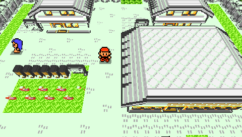
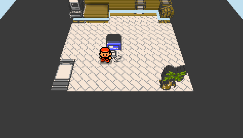
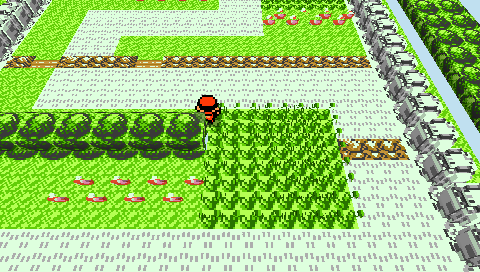

# Pocket Voxel

<p align="center">
  
</p>

<p align="center">
  
  
</p>

<p align="center"><em>All three screenshots are captures from a real PSP-2000 over PSPLINK.
The same build runs on a PS Vita at 960x544 — see <a href="#run-it">Run it</a>.</em></p>

A Game Boy creature-RPG, presented as a voxelized 3D diorama on handheld
hardware — **a real PSP and a real PS Vita, from one cooked pak and one
guest bundle**. The gameplay is a TypeScript port of the
[gen1recomp](https://github.com/bryanthaboi/gen1recomp) Lua engine running in
an embedded QuickJS guest; the presentation is a Rust reimplementation of the
[DramaticShape Voxel Mod](https://github.com/DramaticShape/DramaticShapeVoxelMod)
diorama renderer. Both upstreams are MIT-licensed; both serve here as
executable specifications, not vendored code.

Pocket Voxel is a specialized runtime of
[PocketJS](https://github.com/pocket-stack/pocketjs) — the same
`⟨ core, surface, guest ⟩` composition as
[OpenStrike](https://github.com/pocket-stack/open-strike), with the ownership
split inverted: **the game state lives in the guest** (world, battle, script
VM, menus, saves — every formula cites the Lua it ports), and the Rust core
owns only the retained scene — cooked voxel chunks, entity billboards, camera
rungs, the battle stage, a GB UI tile layer, and the chip synth that renders
the ROM's own sound programs to PCM. Steady-state boundary traffic is a few
ops per tick against a measured QuickJS budget of ~8k ops per frame.

## You bring the ROM

This repository is **ROM-fed, exactly like upstream gen1recomp**: the only
game-content input is a canonical US Gen-1 ROM you already own. The importer
verifies its SHA-1 before decoding one byte, everything decoded lands under
git-ignored `dist/`, and **no ROM-derived byte is ever committed** — no
cooked pak, no extracted art, no decoded text; the rendering goldens are
frame *hashes*, never pixels. The screenshots above are hardware captures of
the running device, the same standard as the EBOOT's XMB art.

## How it works

```text
cook time (Bun, your machine)            run time (PSP / PS Vita)
├─ import/  ROM → gen/ (SHA-1 gated)     ├─ QuickJS guest: the gameplay port,
├─ cook/    voxelizer: classify tiles,   │    one frame(buttons) per tick
│    carve trees, place 42 building      ├─ voxel surface: ~10-40 ops/tick
│    templates, bake ground+facades,     │    drive the retained scene
│    pack chunks → voxelmon.vxpak        ├─ pocketvoxel-core: culling, camera
└─ tapes/   intent tapes → .vtrace       │    rungs, draw list, chip synth
     (the acceptance path)               └─ the backend for this machine:
                                              pocketvoxel-gu  (PSP, sceGu)
                                              pocketvoxel-gxm (Vita, GXM)
```

- **One pak, many machines.** Fidelity is a runtime *ladder*, not a build
  flag: the same 31 MB pak serves the PSP rung (30 fps present lock, 60 Hz
  logic), the Vita rung, and the desktop identity rung — which replays the
  pre-ladder picture pixel-for-pixel and is pinned by committed frame hashes
  no dial edit may move. **The rung is named by the HOST, not the guest**, so
  the guest bundle inside the Vita VPK is byte-identical to the one baked
  into the PSP EBOOT — no `#ifdef`, no second build of the game.
- **Each machine gets its own renderer, not its own fork.** Both consume the
  same ordered draw list and resolve every texture's palette through the same
  function: `pocketvoxel-gu` on the PSP's GE, `pocketvoxel-gxm` on the Vita's
  GXM. The Vita draws it at native 960x544 while the logical viewport stays
  the PSP's 480x272, so the layout, the cameras and every golden are
  unchanged and only the pixel count moves.
- **No camera-relative representation change inside the visible field.** The
  PSP rung pays its frame budget with uniform dials only (coarse-carved
  trees, ground baked to per-chunk pages, stratified detail density) — a
  distance boundary that moves with the player plays as flicker, and this
  repo's rule is that it never ships.
- **Deterministic to the byte.** Two cooks are byte-identical; gameplay is a
  fixed 60 Hz step with tape-recorded intent; the software rasterizer and
  the GE resolve the same draw list within a measured pixel tolerance,
  enforced by a PPSSPP-headless e2e at every story checkpoint.

## Quick start

Needs [Bun](https://bun.sh) and a Rust toolchain. Device builds need one
console toolchain each; both are covered under [Run it](#run-it).

```sh
git clone --recursive https://github.com/pocket-stack/pocket-voxel
cd pocket-voxel && bun install

export VOXELMON_ROM=/path/to/your/rom.gb   # SHA-1 verified before any decode
export VOXELMON_G1R=~/code/gen1recomp      # reference checkouts: the manifest
export VOXELMON_VOXELMOD=~/code/DramaticShapeVoxelMod  # and the tile profiles

bun tools/voxel.ts import   # ROM → dist/voxelmon/gen/
bun tools/voxel.ts cook     # gen/ → dist/voxelmon/voxelmon.vxpak
bun tools/voxel.ts check    # replay the tapes, assert both rungs' hashes
```

## Run it

### Web

The browser build contains the renderer and non-ROM reference metadata, but no
game content. It verifies and bakes a ROM you select entirely in a local Web
Worker, transfers the finished pak into the WASM runtime, then releases the
worker heap.

```sh
rustup target add wasm32-unknown-unknown
cargo install wasm-bindgen-cli --version 0.2.126 --locked
bun run web:build
bun run web:serve            # http://127.0.0.1:8131/
# Optional real-Chrome acceptance with VOXELMON_ROM (or the local default):
bun run web:e2e
```

Drop your canonical US Pokémon Red ROM onto the page. The player maps its
480×272 framebuffer onto a demand-rendered 3D Game Boy; the model's D-pad,
face buttons, Start, and Select are interactive alongside keyboard and standard
gamepad input. The ROM and cooked pak remain in memory for this tab only; they
are neither uploaded nor written to browser storage. The attributed stage model
and its license ship under `web/assets/game-boy/`.

### PSP

Needs the [cargo-psp](https://github.com/overdrivenpotato/rust-psp) toolchain,
which `tools/voxel.ts` resolves and pins for you.

```sh
bun tools/voxel.ts psp --release   # the EBOOT
```

Put `EBOOT.PBP` and `voxelmon.vxpak` in one folder under `ms0:/PSP/GAME/`, or
develop over [PSPLINK](https://github.com/pspdev/psplinkusb) with the pak
served from `host0:`.

### PS Vita

Needs [VitaSDK](https://vitasdk.org) and
[cargo-vita](https://github.com/vita-rust/cargo-vita).

```sh
export VITASDK=~/vitasdk
bun tools/voxel.ts vita --release   # dist/voxelmon/voxelmon.vpk
```

**The VPK carries the pak inside it and needs nothing else on the console.**
Copy it over (VitaShell's `SELECT` starts USB or FTP), press `X` on it,
confirm — that is the whole install. It ships libvita2d's precompiled GXM
shaders, so a stock HENkaku console does not need Sony's runtime shader
compiler (`libshacccg.suprx`) the way most Vita 3D homebrew does.

One honest difference from the PSP picture: the GE cuts sprite art out with a
hardware alpha test and **GXM has none**, so grass, flowers and entity
billboards blend instead of clipping, and give up their baked ambient
occlusion to do it. Solid geometry and the Game Boy UI layer are unaffected —
[docs/VOXEL.md §12](docs/VOXEL.md) has the per-pass accounting.

## Tests

```sh
bun test                    # 241 tests; ROM-gated suites skip with a reason
bun tools/voxel.ts check    # both quality rungs' frame hashes
bun tests/e2e/voxel-ppsspp.ts   # GE-vs-sim parity at 11 story marks
```

## Architecture notes

The full design record is [docs/VOXEL.md](docs/VOXEL.md): the content
boundary, the guest/core split, the VXPK format, the quality ladder and its
identity anchor, the fetch-bound GE findings, and the determinism ceremony
that governs when a committed hash may ever be re-based. The engine arrives
as a pinned git submodule (`vendor/pocketjs`), the OpenStrike pattern: the
PSP host library, the audio module and the toolchain pins all come from one
engine commit — a mainline commit, moved forward deliberately.

## License

MIT. The ROM, and everything derived from it, stays yours and stays local.
